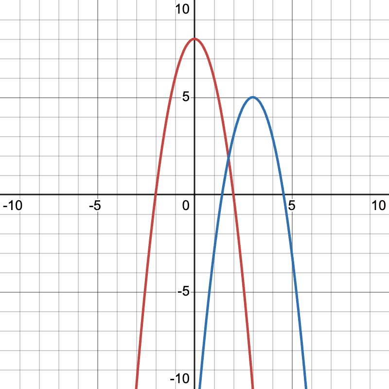

## To determine if two functions have the same shape but are shifted along the x or y axis, you can use the following steps:

### 1. Basic Form of Functions

Consider two functions 𝑓(𝑥) and 𝑔(𝑥). The goal is to determine if 𝑔(𝑥) is a shifted version of 𝑓(𝑥). This means checking if there exists some 𝑎 and 𝑏 such that: 𝑔(𝑥) = 𝑓(𝑥−𝑎) + 𝑏

### 2. Shift Detection in the Y-Axis

To detect a vertical shift, compare the values of 𝑓(𝑥) and 𝑔(𝑥) for the same 𝑥: 𝑏 = 𝑔(𝑥) − 𝑓(𝑥−𝑎)

### 3. Shift Detection in the X-Axis

To detect a horizontal shift, compare the positions of significant features (e.g., peaks, troughs, zero crossings) in 𝑓(𝑥) and 𝑔(𝑥). This can be done by finding 𝑎 such that: 𝑔(𝑥) = 𝑓(𝑥−𝑎) + 𝑏

### 4. Algorithm

Here's a step-by-step algorithmic approach:

Sampling Points: Choose a set of sample points {𝑥𝑖} from the domain of the functions.

Compute Differences: For each 𝑥<sub>𝑖</sub>, compute 𝑔(𝑥<sub>𝑖</sub>) − 𝑓(𝑥<sub>𝑖</sub>).

#### Statistical Analysis for Vertical Shift:

Calculate the mean 𝜇 and standard deviation 𝜎 of the differences 𝑔(𝑥<sub>𝑖</sub>) − 𝑓(𝑥<sub>𝑖</sub>). If 𝜎 is small (close to 0), 𝑏 is approximately 𝜇, indicating a consistent vertical shift.

Adjust for Vertical Shift: Subtract 𝑏 from 𝑔(𝑥): 𝑔′(𝑥) = 𝑔(𝑥) − 𝑏

#### Cross-Correlation for Horizontal Shift:

Compute the cross-correlation between 𝑓(𝑥) and 𝑔′(𝑥) to find the horizontal shift 𝑎. The lag 𝑎 where the cross-correlation is maximized indicates the horizontal shift.

Verify: Check if 𝑔′(𝑥) ≈ 𝑓(𝑥−𝑎) for all 𝑥.

### 5. Implementation

Here's a simple implementation in Python:

`shifts.py`



```text
@clorton ➜ /workspaces/func-shape-match (main) $ python3 ./shifts.py
Horizontal shift: 0
Vertical shift: -21.0
```

# 🧐

### 6. Interpretation

- Horizontal shift (𝑎): Indicates how much 𝑔(𝑥) is shifted along the x-axis.
- Vertical shift (𝑏): Indicates how much 𝑔(𝑥) is shifted along the y-axis.

If 𝑎 and 𝑏 are both non-zero, 𝑔(𝑥) is a shifted version of 𝑓(𝑥) both horizontally and vertically. If either is zero, the shift is only in one direction.

By following this approach, you can determine if two functions are the same shape but shifted along the x or y axis.
